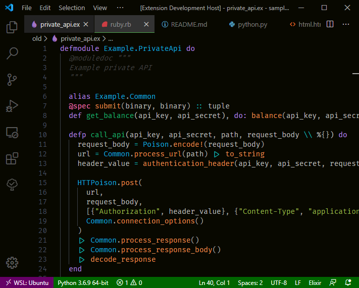
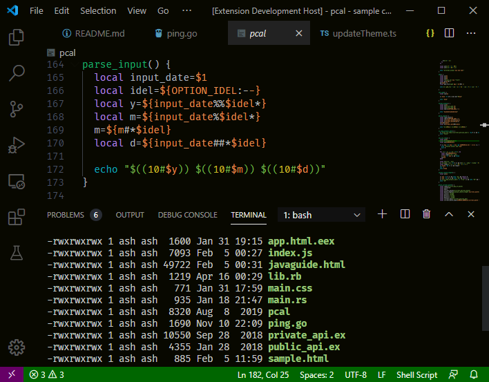

# Night Coder

A dark theme based on [One Dark Pro](https://github.com/Binaryify/OneDark-Pro) and [Darker One](https://github.com/a5hk/darker-one)l

## Screenshots

 Modification indicators with `"workbench.editor.highlightModifiedTabs": true`.

## License

[MIT License](LICENSE)

## Acknowledgments

- [Open Window and Google Fonts](https://fonts.google.com/specimen/Caesar+Dressing)
