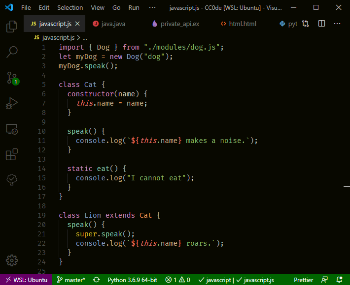
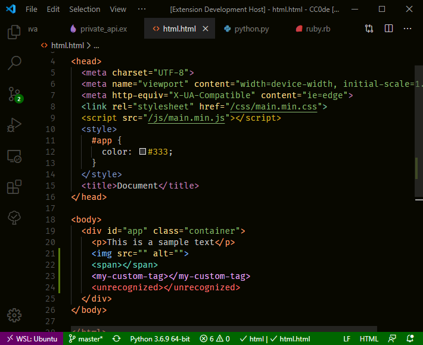
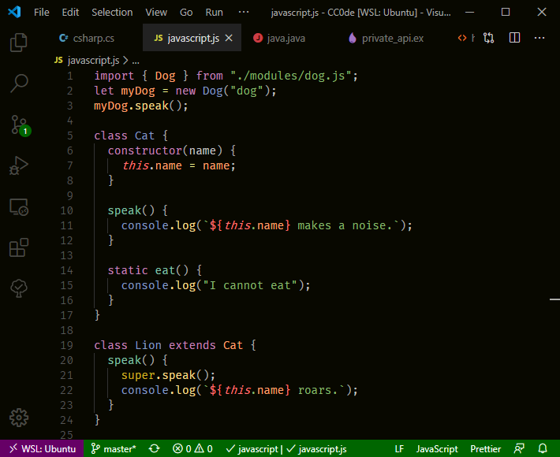
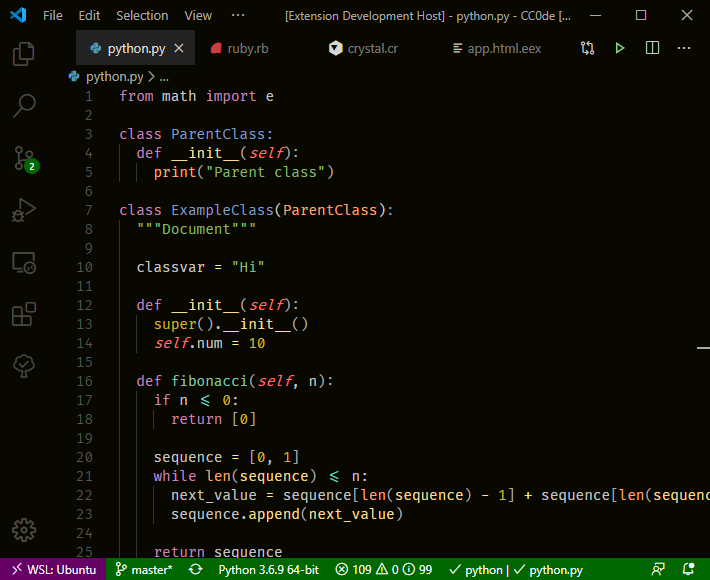
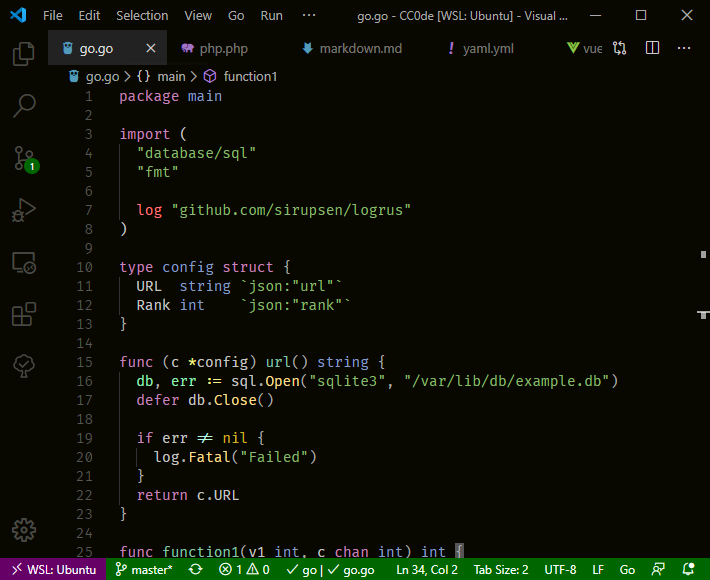
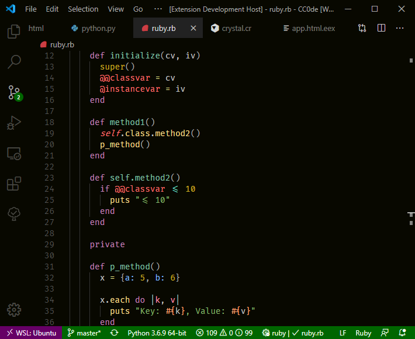

# Night Coder

A dark theme for Night Coders. There are two versions: _dark_ and _bright_.

## Screenshots

### HTML

### Javascript

### Python

### Go

### Ruby

 Modification indicators with `"workbench.editor.highlightModifiedTabs": true`.

### Markdown

#### Currently supports:

- C#
- C++
- Crystal
- CSS
- Dart
- Elixir
- Go
- GraphQL
- Haskell
- HTML
- Java
- JavaScript
- JavaScript React (JSX)
- JSON
- Kotlin
- Markdown
- PHP
- Python
- Ruby
- Rust
- SCSS
- Shell/Bash
- Swift
- TOML
- TypeScript
- TypeScript React (TSX)
- Vue
- YAML

## License

[MIT License](LICENSE)
