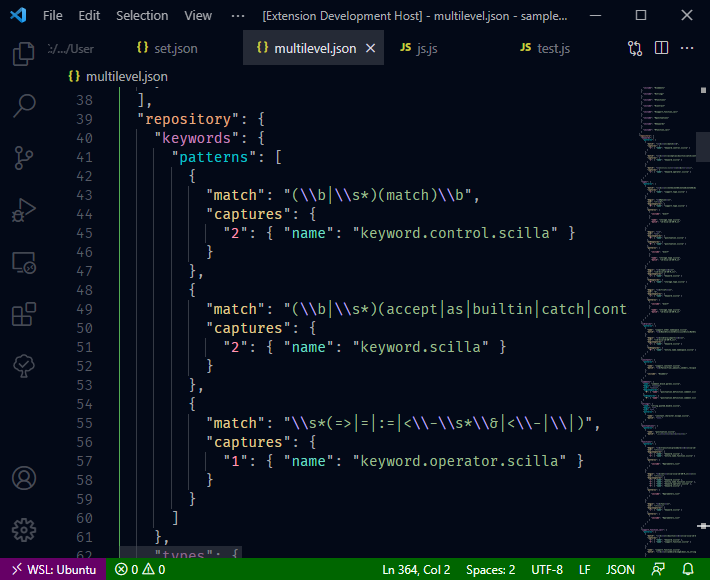

# [Night Coder](https://marketplace.visualstudio.com/items?itemName=a5hk.night-coder)

A dark theme for Night Coders. It has four variants with different text styles and UI colors.

### Color palette

## Other versions

- Vim: [/vim/colors/](/vim/colors/)

## Regular Color Palette

| Scope | Color | Hex |
|:------|:-----:|:----|
|Default library function, HTML inline tag||#7dbbe8|
|Function call, Attribute name||#e0cd94|
|Foreground, Variable||#c6c7ca|
|Constant, HTML unrecognized tag||#ef7762|
|Miscellaneous||#c3ab85|
|Type||#0bc2cb|
|Parameter, Argument||#e5e6e7|
|Operator||#f2f28c|
|Comparison/Logical operator||#93ecb8|
|Comment||#464b55|
|Documentation comment||#abadb2|
|Function declaration, HTML link tag||#85c3ab|
|Non variable constant, HTML custom tag||#bfa6f2|
|Default library class/type, HTML object tag||#ff99b3|
|Namespace/Class/Struct, HTML style tag||#859dc3|
|Tag punctuation||#797c83|
|Script tag||#d9d326|
|String||#84bd7f|
|Property, Tag ||#e4aa81|
|Keyword, HTML meta tag||#c385bc|

## Screenshots

### JavaScript

### JSON

### Python

## License

[MIT License](LICENSE)
