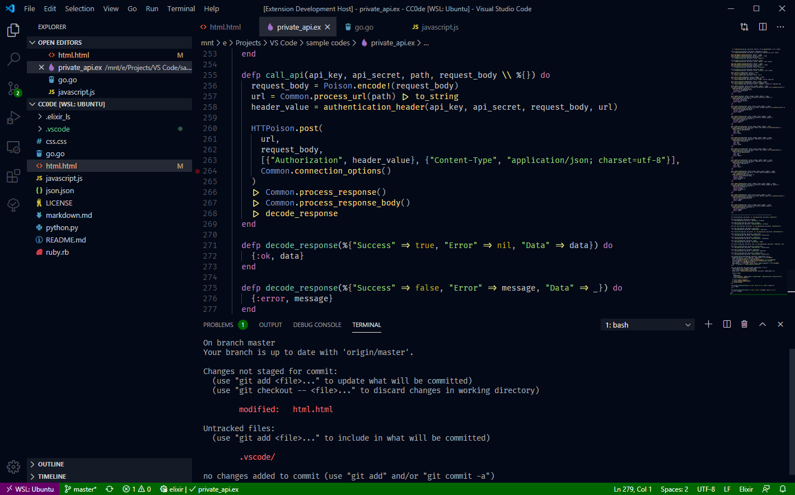
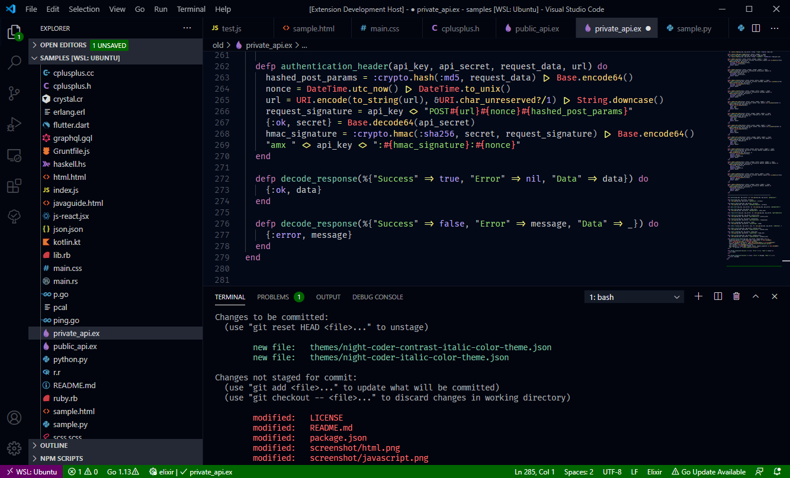

# [Night Coder](https://marketplace.visualstudio.com/items?itemName=a5hk.night-coder)

A dark theme for Night Coders. It has two versions: Night Coder and Night Coder Contrast. [Comparison](#Comparison)

## Screenshots

### HTML

### JavaScript

### Python

 Modification indicators with `"workbench.editor.highlightModifiedTabs": true`.

### Markdown

### Comparison

#### Currently supports:

- C#
- C++
- Crystal
- CSS
- Dart
- Elixir
- Gettext
- Go
- GraphQL
- Haskell
- HTML
- Java
- JavaScript
- JavaScript React (JSX)
- JSON
- Kotlin
- Markdown
- PHP
- Python
- Ruby
- Rust
- SCSS
- Shell/Bash
- Swift
- TOML
- TypeScript
- TypeScript React (TSX)
- Vue
- YAML

## License

[MIT License](LICENSE)
