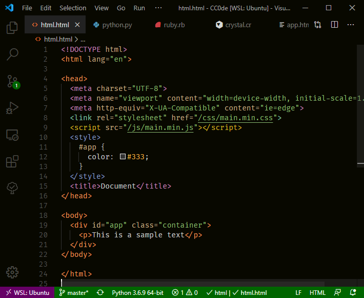
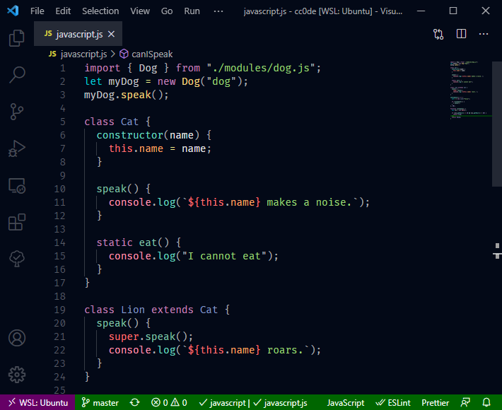
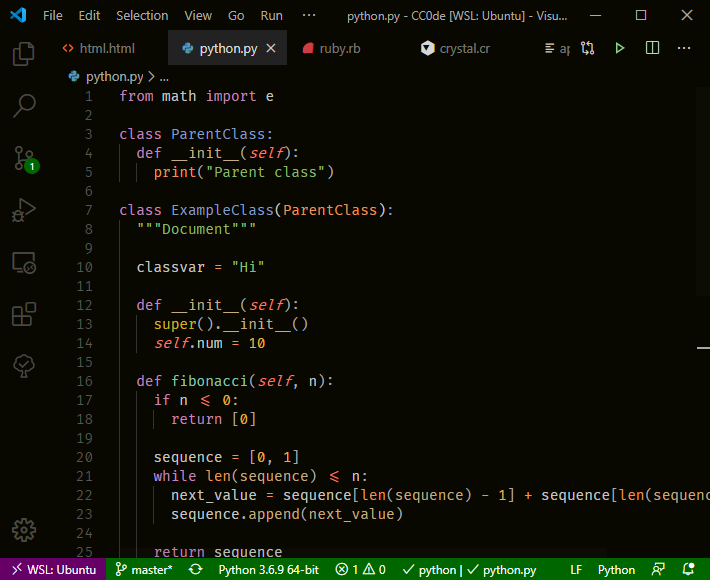
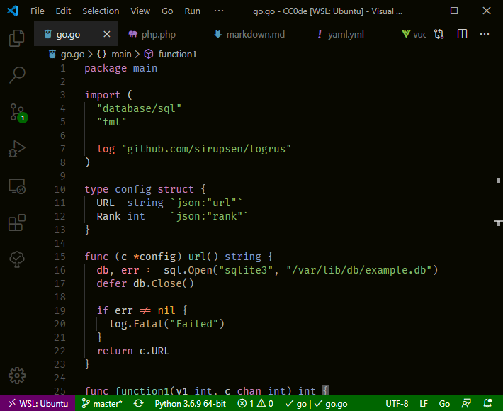
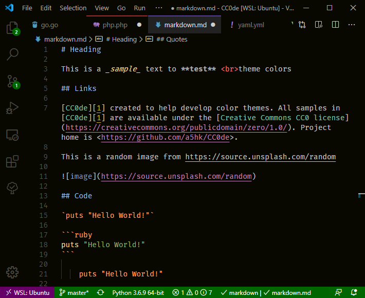

# Night Coder

A new dark theme fro Night Coders.

## Screenshots

### HTML

### Javascript

### Python

### Go

### Ruby

 Modification indicators with `"workbench.editor.highlightModifiedTabs": true`.

### Markdown

#### Currently supports:

- C++
- CSS
- Elixir
- Go
- HTML
- Javascript
- Json
- Markdown
- PHP
- Python
- Ruby

## License

[MIT License](LICENSE)
