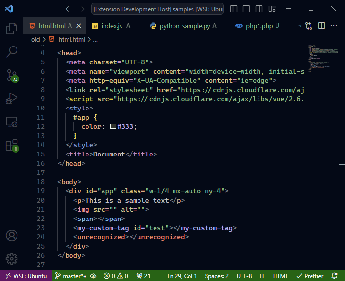

# Night Coder

A dark theme for Night Coders.

## Other versions

- [VS Code](/vscode/): This is the main version. You can download it from the [VS Code marketplace](https://marketplace.visualstudio.com/items?itemName=a5hk.night-coder) or [Open VSX](https://open-vsx.org/extension/a5hk/night-coder)
- [Vim](/vim/colors/): A port of the color scheme for vim.
- [bat](/bat/): A port of the color scheme for [bat](https://github.com/sharkdp/bat)
- [Windows Terminal](/windows-terminal): A port for [Windows Terminal](https://github.com/microsoft/terminal)

## How to contribute

Built using [Theme Generator](https://github.com/a5hk/theme-generator). [Contribution Guide](https://github.com/a5hk/theme-generator/blob/master/CONTRIBUTING.md)

## License

[MIT License](LICENSE)
